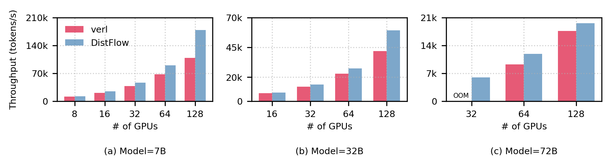
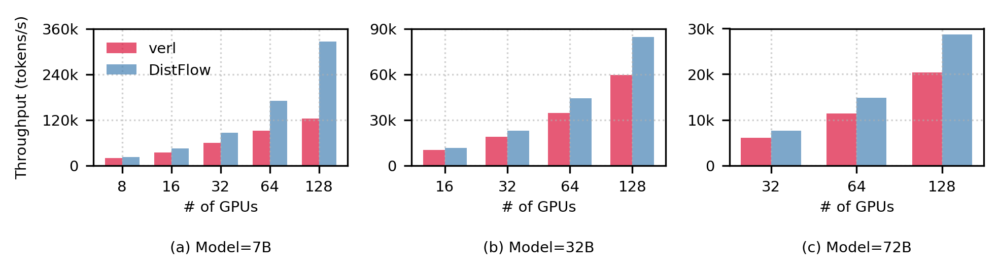
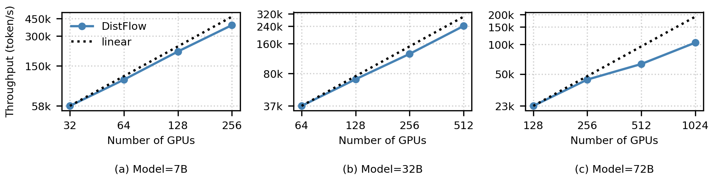
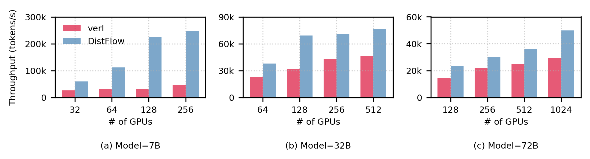
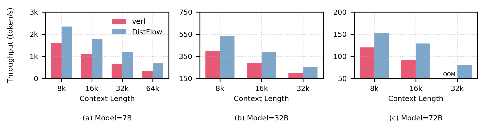
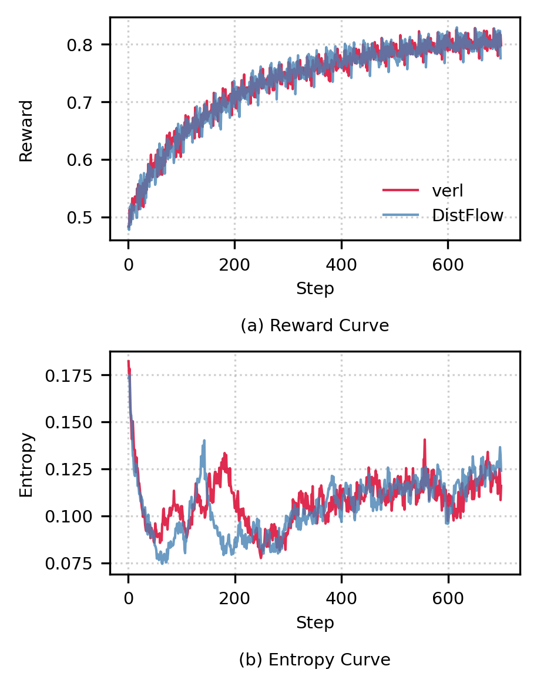

<div align="center">
  
  <br>
</div>
<br>

<h1 align="center">
siiRL: Shanghai Innovation Institute RL Framework for Advanced LLMs and Multi-Agent Systems
</h1>

<p align="center">
| <a href="https://arxiv.org/abs/2507.13833"><b>📄 Paper</b></a> 
| <a href="https://siirl.readthedocs.io/en/latest/index.html"><b>📚 Documentation</b></a> 
| <a href="asset/siiRL-feishu-group.png">
     
    <b> Feishu Group</b>
  </a> 
| <a href="asset/siiRL-wechat-group.png">
     
    <b> Wechat Group</b>
  </a> 
| <a href="README-zh.md"><b>🇨🇳 中文</b></a> |
</p>

**siiRL** is a novel, **fully distributed reinforcement learning (RL) framework** designed to break the scaling barriers in LLM post-training. Developed by researchers from **Shanghai Innovation Institute**, siiRL tackles the critical performance bottlenecks that limit current state-of-the-art systems.

By eliminating the centralized controller common in other frameworks, siiRL delivers **near-linear scalability**, **dramatic throughput gains**, and **unprecedented flexibility** for RL-based LLM development.

---

## 🚀 Highlights

+ **Near-Linear Scalability**: The multi-controller paradigm eliminates central bottlenecks by distributing control logic and data management across all workers, enabling near-linear scalability to thousands of GPUs.

+ **SOTA Throughput**: Fully distributed dataflow architecture minimizes communication and I/O overhead, achieving SOTA throughput in data-intensive scenarios.

+ **Flexible DAG-Defined Pipeline**: Decouple your algorithmic logic from the physical hardware. With siiRL, you can define complex RL workflows as a simple Directed Acyclic Graph (DAG), enabling rapid, cost-effective, and code-free experimentation.

+ **Cross-Hardware Compatibility**: siiRL now officially supports Huawei's Ascend NPUs, providing a high-performance alternative for training and inference on different hardware platforms.

+ **Proven Performance & Stability**: Extensively benchmarked on models from 7B to 72B, siiRL delivering excellent performance across a wide range of tasks. Its advantages are particularly evident in data-intensive workloads such as long-context and multi-modal training.

---

## 📰 News

* **[2025/07]**: We are excited to release siiRL to the open-source community! Check out our [paper](https://arxiv.org/abs/2507.13833) for a deep dive into the architecture and evaluation.

* **[2025/07]**: siiRL now supports [CPGD](https://arxiv.org/pdf/2505.12504v1), a novel algorithm that enhances RL training stability and performance by regularizing large policy updates.

* **[2025/07]**:siiRL adds [MARFT](https://arxiv.org/pdf/2504.16129) support for LaMAS, enabling RL fine-tuning of multi-LLM agents via Flex-POMDP.

---

## 💡 Architecture Overview

siiRL is a fully distributed RL framework designed for scalability on large-scale clusters. siiRL employs a multi-controller paradigm that uniformly dispatches all computational and data flow across each GPU. siiRL consists of three main components: a DAG Planner, DAG Workers, and a Data Coordinator. 

<div align="center">
  
  <p><i>Figure 1. Overview of siiRL.</i></p>
</div>

siiRL solves this problem with a **fully distributed, multi-controller architecture**.

Key components include:
* **DAG Planner**: Translates a user-defined logical workflow (DAG) into a serialized, executable pipeline for each worker.
* **DAG Workers**: The core execution units, with each worker bound to a single GPU, running its assigned tasks independently.
* **Data Coordinator**: A set of distributed components (`Distributed Dataloader` and `Distributed Databuffer`) that manage the entire data lifecycle, from initial loading to intermediate data redistribution, without a central coordinator.

##  🧪 Experiment

We conducted a comprehensive evaluation of siiRL's performance and scalability across various scenarios, comparing it with the SOTA RL framework, verl. The experiments demonstrate that siiRL exhibits outstanding performance across all metrics.

### End-to-End Throughput
Under the standard PPO and GRPO algorithms, siiRL's throughput comprehensively surpasses the baseline. Particularly with the more data-intensive GRPO algorithm, siiRL effectively resolves data bottlenecks through its fully distributed architecture, achieving up to a 2.62x performance improvement.

<p align="center">

<br>
<em>Figure 2: End-to-end performance comparison using the PPO algorithm </em>
</p>
<p align="center">

<br>
<em>Figure 3: End-to-end performance comparison using the GRPO algorithm </em>
</p>

### Large-Scale Scalability
siiRL demonstrates near-linear scalability, smoothly extending up to 1024 GPUs. In contrast, the baseline framework fails under identical conditions due to OOM errors caused by its single-point data bottleneck. At the maximum batch size the baseline can support, siiRL's performance advantage can be as high as 7x.

<p align="center">

<br>
<em>Figure 4: Near-linear scalability of siiRL on VLM models </em>
</p>

<p align="center">

<br>
<em>Figure 5: VLM task performance comparison under the baseline's maximum load </em>
</p>

### Long-Context Performance
When processing long-context tasks, data transfer overhead becomes a major bottleneck. siiRL's distributed dataflow design allows its performance advantage to become more pronounced as context length increases, achieving up to a 2.03x throughput improvement and successfully running a 72B model long-context task that the baseline could not handle.

<p align="center">

<br>
<em>Figure 6: Performance comparison in long-context scenarios </em>
</p>

### Model Convergence
Experiments confirm that siiRL's performance optimizations do not come at the cost of model accuracy. With identical hyperparameters, siiRL's reward and entropy convergence curves are identical to the baseline's, while reducing the total training time by 21%.

<p align="center">

<br>
<em>Figure 7: Model convergence curve comparison </em>
</p>

---

## 📚 Resources

<a href="https://siirl.readthedocs.io/en/latest/index.html"><b>Documentation</b></a>

- <a href="https://siirl.readthedocs.io/en/latest/start/install.html"><b>Installation</b></a>

- <a href="https://siirl.readthedocs.io/en/latest/start/quickstart.html"><b>Quickstart: Running PPO/GRPO</b></a>

---

## 🗓️ Future Plans

siiRL is under active development. We are excited about the future and are focused on extending the framework's capabilities in two key directions: advancing multi-agent support and optimizing the base framework.

### 🚀 Advanced Multi-Agent Capabilities
Our flexible DAG-based design provides a natural and powerful foundation for complex multi-agent systems. We plan to make this a first-class feature by:

* **[ ]** Sophisticated Agent Interaction Workflows.

* **[ ]** Expanded Multi-Agent RL (MARL) Algorithm Support.

* **[ ]** Rich Environment Interaction.

### 🔧 Base Framework Enhancements
We are continuously working to improve the performance, efficiency, and scalability of the core system. Key priorities include:


* **[ ]** Megatron-LM and SGlang Integration.

* **[ ]** Optimizing Model Flops Utilization (MFU).

* **[ ]** Solving the Rollout Long-Tail Issue.

* **[ ]** Expanding Hardware Support.

We welcome community contributions! Please see our [Contributing Guide](CONTRIBUTING.md) to get started.

---

## 🙏 Acknowledgement

We would first like to thank the open-source RL framework [verl](https://github.com/volcengine/verl), which we used as a primary baseline for our evaluations. We would like to directly acknowledge its hierarchical API design; we reuse the 3DParallelWorker base class from verl to manage system components in siiRL.

siiRL is also built upon a foundation of other great open-source projects. We would like to thank the teams behind PyTorch, Ray, vLLM, vLLM-Ascend and SGLang for their incredible work.

Our work aims to address the scalability challenges identified during our research, and we hope siiRL can contribute positively to the community's collective progress.

---

## 🖋️ Citation

If you find siiRL useful in your research, please consider citing our paper.

```bibtex
@misc{wang2025distflowfullydistributedrl,
      title={DistFlow: A Fully Distributed RL Framework for Scalable and Efficient LLM Post-Training}, 
      author={Zhixin Wang and Tianyi Zhou and Liming Liu and Ao Li and Jiarui Hu and Dian Yang and Jinlong Hou and Siyuan Feng and Yuan Cheng and Yuan Qi},
      year={2025},
      eprint={2507.13833},
      archivePrefix={arXiv},
      primaryClass={cs.DC},
      url={https://arxiv.org/abs/2507.13833}, 
}
```

